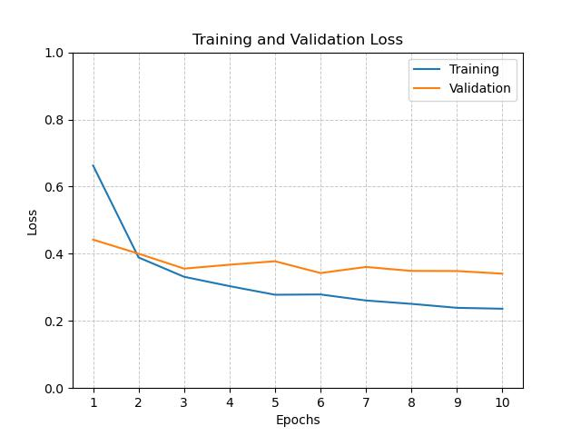

# Garbage Classification Capstone Project

A deep learning-based solution to automate waste sorting, built as part of the Data Science Career Track. This project leverages a fine-tuned **ConvNeXt** model to classify garbage images into six categories (paper, plastic, metal, glass, cardboard, trash) with over 91% accuracy. An accompanying Flask API provides seamless integration for real-world applications, including retraining and dynamic configuration.

---

## Table of Contents

- [Project Overview](#project-overview)
- [Key Features](#key-features)
- [Dataset & Preprocessing](#dataset--preprocessing)
- [Modeling & Hyperparameter Tuning](#modeling--hyperparameter-tuning)
- [API & Implementation](#api--implementation)
- [Deployment Strategy](#deployment-strategy)
- [Results & Visualizations](#results--visualizations)
- [Future Directions](#future-directions)
- [Conclusion](#conclusion)

---

## Project Overview

Waste management is a global challenge, and manual sorting is often inefficient and error-prone. This project builds an automated system to:
- **Increase sorting accuracy**
- **Reduce labor and operational costs**
- **Improve recycling rates**

The system is designed to be production-ready, enabling both inference and retraining via API endpoints.

---

## Key Features

- **One-click Retraining:** Retraining is triggered via an API endpoint and supports three distinct modes:
  - **From Scratch (Original Dataset):** Train the model from scratch using the original TrashNet dataset.
  - **Fine-tuning:** Update the current model by fine-tuning it with newly labelled data.
  - **From Scratch (Combined Dataset):** Train the model from scratch using a combined dataset that includes both the original images and newly labelled images.
- **Versatile API:** Built with Flask, the API supports multiple endpoints for predictions, configuration changes, retraining, and configuration management.
- **Robust Model:** Utilizes a fine-tuned ConvNeXt architecture to handle image classification tasks.
- **Flexible Configuration:** Easily update hyperparameters (learning rate, batch size, etc.) via API endpoints.
- **Scalable Deployment:** Containerized using Docker and deployed on AWS for cloud scalability.
- **Logging & Debugging:** Comprehensive logging and a debug mode with a configurable level of detail capture error and performance data, facilitating effective troubleshooting and system monitoring.

---

## Dataset & Preprocessing

- **Dataset:** TrashNet (2,527 images, 6 waste categories)
- **Preprocessing Steps:**
  - Resizing images to 242×242 pixels
  - Normalization using ImageNet statistics
  - On-the-fly data augmentation (rotations, flips, zooms, brightness/contrast shifts)
- **Data Splits:** 70% training, 10% validation, 20% testing

**The sample images:**  

**The augmented images:**  

---

## Modeling & Hyperparameter Tuning

- **Primary Model:** ConvNeXt (using pre-trained weights and a modified 6-class output layer)
- **Experimental Model:** YOLOv8 (explored for its real-time detection capabilities)
- **Hyperparameter Tuning:** Custom grid search over parameters such as learning rate, decay, and batch size with results indicating ~92% test accuracy.
- **Key Metrics:** Trade-offs between precision and recall were observed, with the “trash” class remaining the most challenging due to data imbalance.

   

---

## API & Implementation

The Flask application serves as the interface to the model and includes:

- **Prediction Pipeline:** Processes input images with the same transformations as during training except augmentation.
- **Retraining Module:** Supports retraining via an API endpoint, offering three modes:
  - **From Scratch (Original Dataset)**
  - **Fine-Tuning**
  - **From Scratch (Combined Dataset)**
- **Key Endpoints:**
  - `/` – API documentation.
  - `/predict` – Batch/single-image predictions.
  - `/retrain` – Initiates model retraining (with options for the three retraining modes).
  - `/change` – Adjust configuration parameters.
  - `/info` – Retrieves current settings.
  - `/save_config` – Saves the current configuration.
  - `/restore_config` – Restores configuration from a file.
- **Output Modes:** The API supports two output modes – web mode (returning HTML responses) for browser-based interaction, and application mode (returning JSON responses) for programmatic integration. This flexibility allows users to choose the most suitable interface based on their needs.

**Screenshot of the homepage with API Documentation:**  

---

## Deployment Strategy

- **Docker Containerization:** The entire environment is encapsulated in a Docker image, ensuring consistency across deployments.
- **AWS Cloud Deployment:** Hosted on an EC2 instance with GPU support, with both model weights and the TrashNet dataset loaded from an S3 bucket to speed up the deployment process.
- **Scalability:** The solution is designed to support multiple instances and rapid deployment in production environments.

---

## Results & Visualizations

- **Accuracy:** Achieved ~92.06% on the test set.
- **Precision & Recall:** All classes are generally balanced, though the "trash" class remains an area for further improvement. No single hyperparameter set achieved both precision and recall ≥85% simultaneously, so users must choose trade-offs based on business needs.
- **Performance:** Inference processing time is approximately 0.003 sec per image on a g5.x2large AWS EC2 instance.
- **Observations:** Training was stable with minimal overfitting after applying robust augmentation techniques.

**Screenshot of Prediction Results (example):**  
  
**Screenshot of Retraining Results (example):**  

---

## Future Directions

- **Cross-Validation:** Implement K-fold cross-validation for more robust model evaluation.
- **Advanced Class Balancing:** Explore techniques like oversampling or SMOTE for minority classes.
- **Edge Deployment:** Develop lightweight models for real-time inference on embedded devices.
- **Extended Model Exploration:** Further experimentation with YOLOv8 for enhanced detection capabilities.

---

## Conclusion

This capstone project demonstrates a practical application of deep learning in waste management. The combination of a robust model, versatile API, and scalable deployment architecture makes this solution a strong candidate for real-world adoption. By continuously improving data handling and model performance, this system aims to revolutionize the way waste is sorted and recycled.

---
